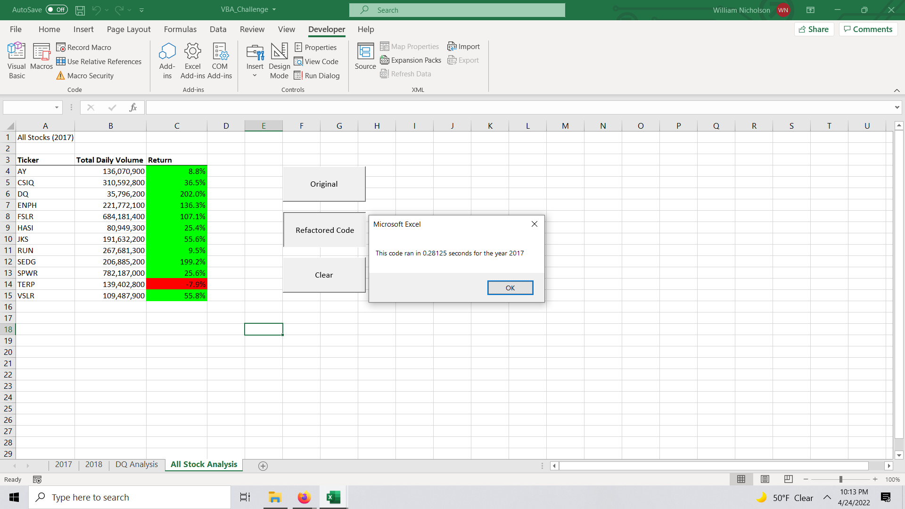
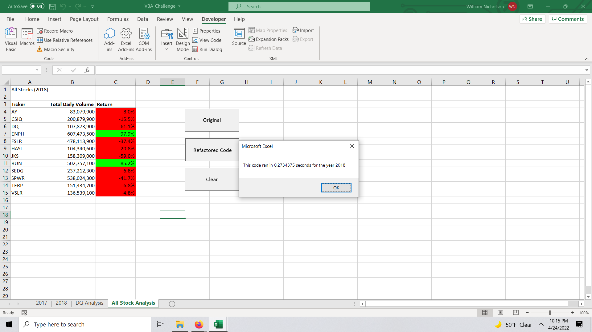

# Analysis of Yearly Stock Returns
 
## Overview of Project

### Purpose
-Analize a data set of Stock Returns from 2017 and 2018 and consider DAQO for investment posibilities. 

-To construct a macro with Visual Basic that will loop thru both data sets and highlight the amount of annual 
sales and returns for each company. 

## Results

Considering the results of DQ we can see that the results varied each year. The only stock evaluted across the two years that performed well was ENPH.

## Summary

Refactoring the code reduced the run time significantly. Generally, when we refactor code we make it more concise and remove unneeded portions. When the macro is easier to read it improves comprehension for other programmers. If this process is not done correctly there may be new bugs introduced. 

Considering the original code is equally important. While the original is operating correctly, it becomes difficult to conceptualize a code with the same functionality. The benefit of refactoring is not always initially recognizable. 

